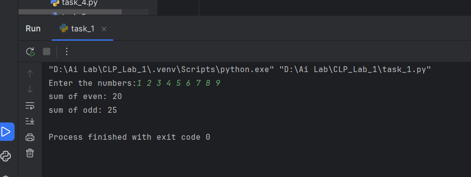
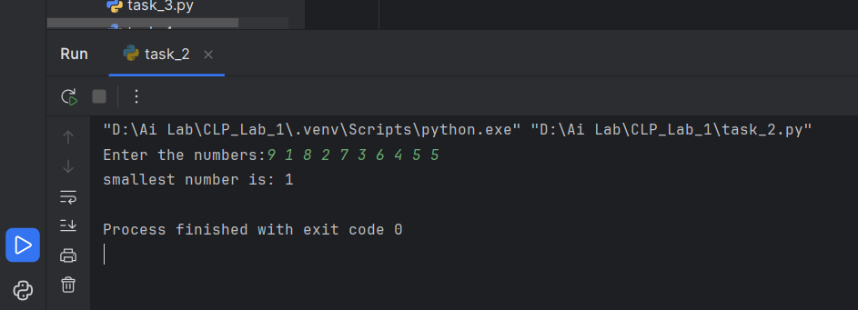
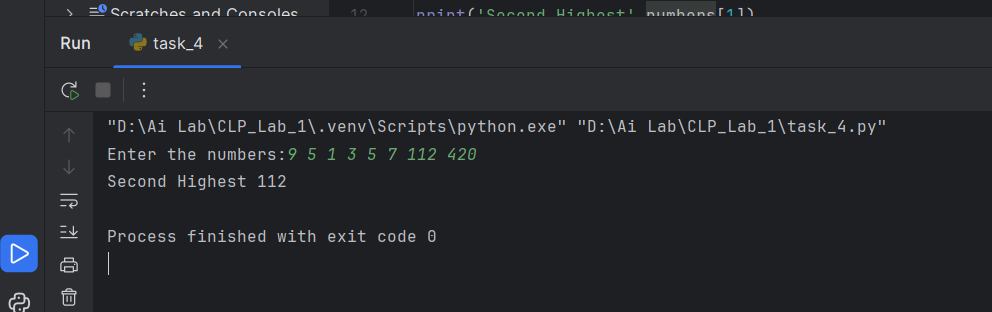
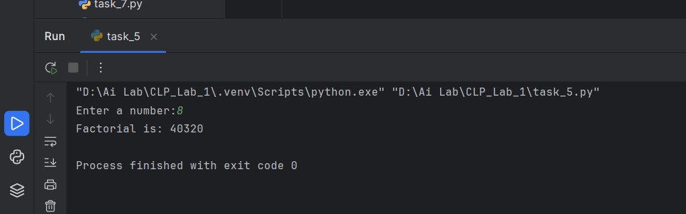
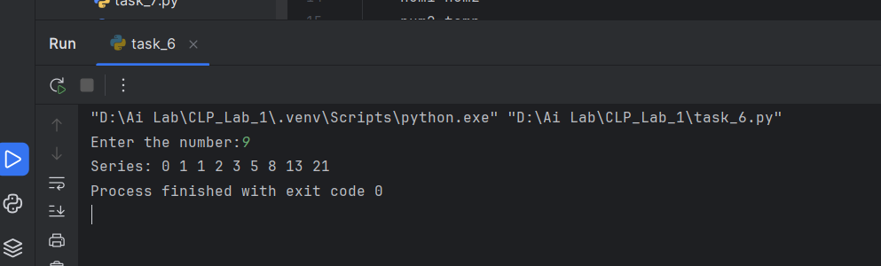
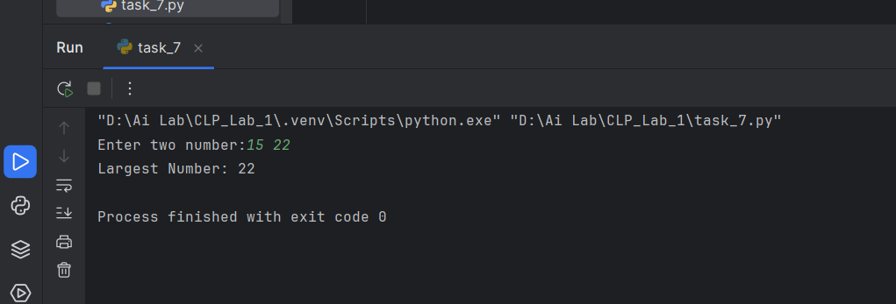
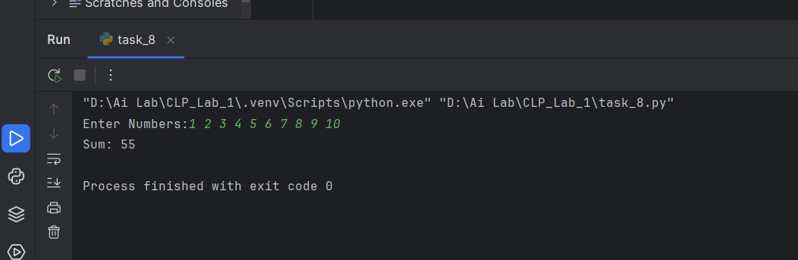

## Lab Tasks

### Task 1: Write a Python program to find the sum of odd and even numbers from a set of numbers  

### Task 2: Write a Python program to find the smallest number from a set of numbers  

### Task 3: Write a Python program to find the sum of numbers between 50 and 100 (divisible by 3, not by 5)  
![Sum Between 50-100 (ScreenShot/task_3.png)

### Task 4: Write a Python program to find the second highest number from a set of numbers  

### Task 5: Write a Python program to find the factorial of a number using a for loop  

### Task 6: Write a Python program to generate the Fibonacci series  

### Task 7: Write a Python program to find the largest number between two numbers using a function  

### Task 8: Write a Python program to find the sum of numbers passed as parameters  

