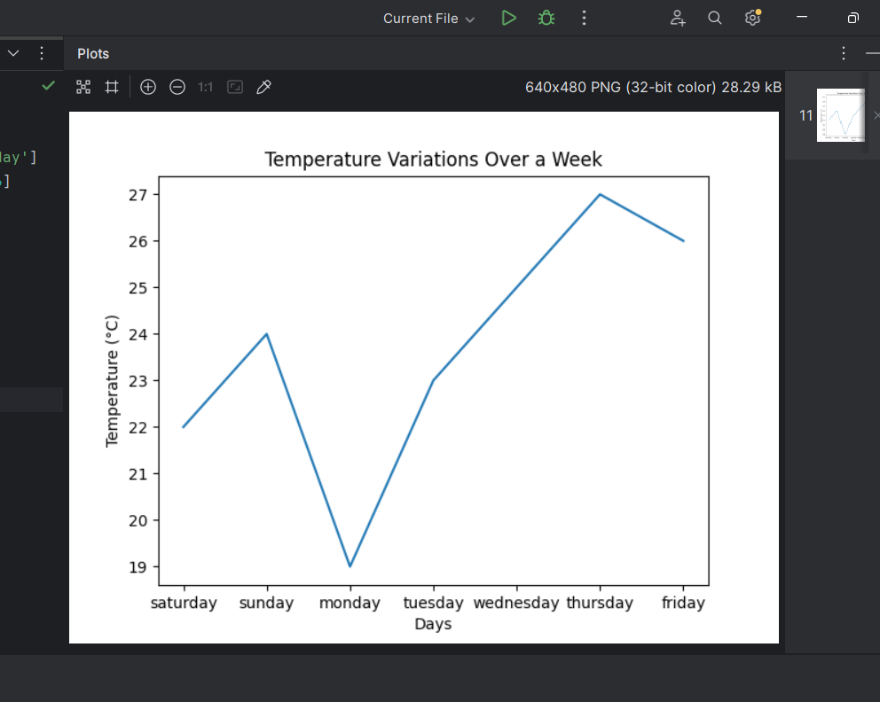

##Task-1: **Remove duplicates and sort in ascending order**  
     

##Task-2: **Find the common elements between two lists using sets**  
     

3. **Create a tuple of student records and sort by grade**  
     

4. **Count word occurrences in a given text and store them in a dictionary**  
     

5. **Generate a 5x5 matrix of random integers and compute row-wise sums**  
     

6. **Create an array of 100 random values and normalize them between 0 and 1**  
     

7. **Load a CSV file of sales data and compute total revenue per product**  
     

8. **Fill missing values in a dataset with column-wise means**  
     

9. **Plot a line graph showing temperature variations over a week**  
     

10. **Create a bar chart comparing sales revenue across different regions**  
     
