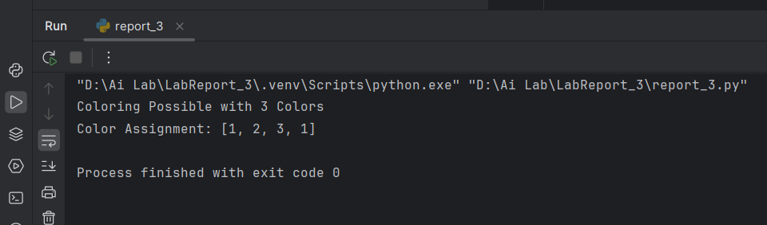
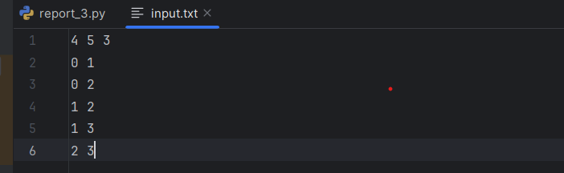
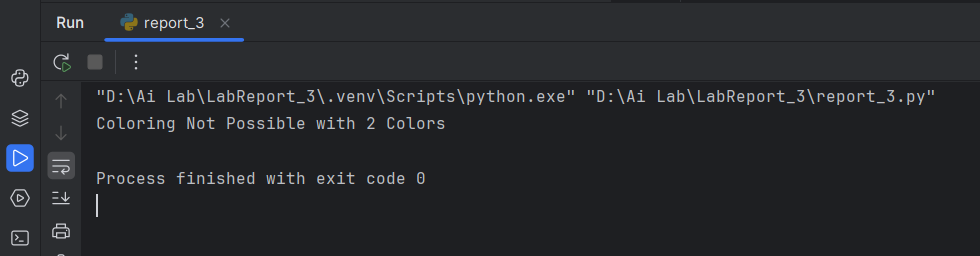
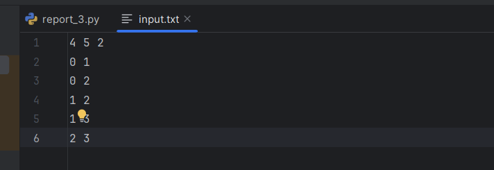

# Here are the results of my Lab Task:

  
*Figure 1: This is the output when coloring is possible with given k.*

  
*Figure 2: This is the corresponding input file for case 1.*

  
*Figure 3: This is the output when coloring is not possible with given k.*

  
*Figure 4: This is the corresponding input file for case 2.*
