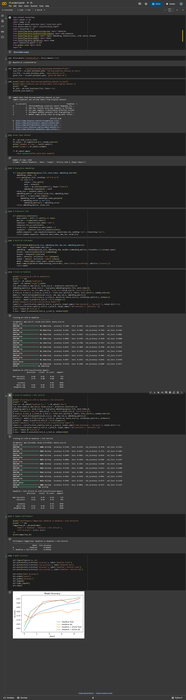

# Sarcasm Detection with Context

This project demonstrates the importance of context in detecting sarcasm.  
Detecting sarcasm from short texts is challenging, as key contextual information is often missing.  

## Dataset
The project uses the **Sarcasm Headlines Dataset v2** from Hugging Face.  
- The dataset contains only news headlines, which lack sufficient context.  
- Each headline includes a **source link** to the original article.  
- A Python script was used to fetch the **full news articles** from these links.  

## Approach
1. Train a Bi-LSTM model on **headlines only**.  
2. Train a Bi-LSTM model on **headlines + full articles**.  
3. Compare their performance.  

A significant difference in accuracy was observed, highlighting the importance of contextual information in sarcasm detection.

## Requirements
To run the project:  
1. Download the **embedding files**, **dataset**, and **project.ipynb** from the provided Google Drive link.  
2. Place all files in a single folder.  
3. Open and run `project.ipynb`.  

📂 Drive link: [Download Project Files](https://drive.google.com/drive/folders/1bXHSnGsTyOAtM6v0uBPSpXTiIxUqJ-Dx?usp=sharing)

## Output
The final output comparison is shown below:  

